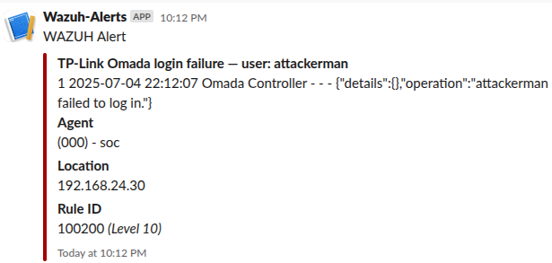

# Wazuh Home‑Lab (Ubuntu 24.04 + WireGuard)

<p align="center">
  
</p>

## ✨  What is this?

Hands‑on SIEM environment built from scratch to practice blue‑team workflows and showcase DevSecOps skills.

| Component            | Devices / Software                       | Highlights                                  |
|----------------------|------------------------------------------|---------------------------------------------|
| **SIEM Core**        | Wazuh 4.12 on Ubuntu 24.04 (VirtualBox)  | Manager + Indexer + Dashboard<br> -Custom decoder and rule set <br> -**Noise-tuning rules applied**|
| **Endpoints**        | Windows 11 laptop, Ubuntu desktop, Win 10 (remote) | Split-tunnel WireGuard onboarding |
| **Storage Appliance**| Synology NAS                             | Syslog ingestion, custom decoder            |
| **Firewall / Router**| TP-Link Omada ER605                      | Firewall events via syslog					|
| **SDN Controller**   | Omada Controller                         | Login-failure decoder & rule (T1078)        |
| **ChatOps**          | Slack (#sec-alerts)			          | Critical alerts via webhook                 |


## 🚀  Quick start

```
# Clone
git clone https://github.com/brianbrandson/wazuh-homelab.git
cd wazuh-homelab
sudo ./scripts/manager-setup.sh   # installs Wazuh manager in one step
```

Full instructions live in `docs/`.

## 🗺️  Repo structure
```
architecture/        -> diagrams
scripts/             -> install & helper scripts
config-templates/    -> sample configs (no secrets)
decoders/ & rules/   -> custom XML (Omada, Synology)
docs/                -> deep‑dive guides
maintenance/         -> backups & retention
```

## 📸  Screenshots

| MITRE ATT&CK test | Alert in Wazuh | ChatOps |
|-------------------|----------------|---------|
| T1110 |  | *Coming soon* |
| T1078 |  |  |

## 🛡️  Security notice

All keys, passwords and private information are excluded via \`.gitignore\`. Replace placeholders (\`<TOKEN>\`, \`<IP>\`) with real values on your own network.

## 📜  License

This project is released under the [MIT License](LICENSE).
