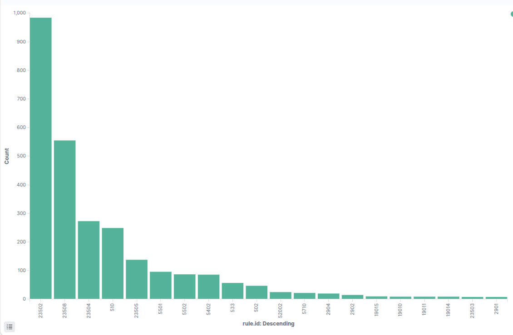
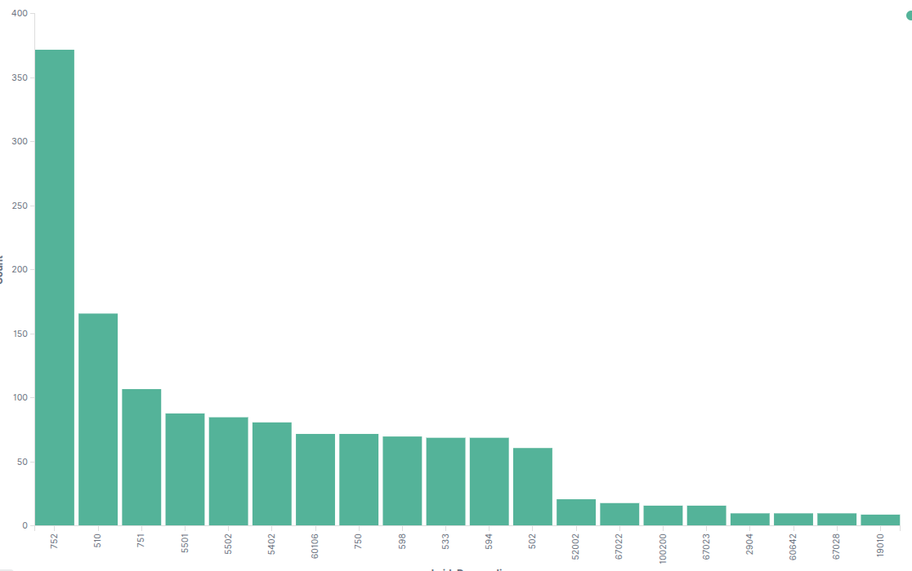

# Noise‑Tuning Log

Documenting every change made to **`local_rules.xml`** or **`agent.conf`** that reduces alert fatigue while keeping relevant security signal.

| Date (UTC) | SID(s) | Original Level | New Level / Action | Rationale |
|------------|--------|---------------|--------------------|-----------|
| 2025‑07‑04 | 23508 | 3 | **0 – Suppressed** | “CVE awaiting analysis” events from Vulnerability‑Detector exceeded 500/day yet add no actionable value until each CVE is scored. |
| 2025‑07‑04 | 23502 | 3 | **1 – Informational** | “CVE solved” notifications generated ~1k/day after package updates. Kept searchable but hidden from alert view. |
| 2025‑07‑04 | 23504 | 7 | **5 – Low priority** | Medium‑severity CVEs matter for posture reporting but do not merit high‑severity alerts; downgrading reduces noise. |

---

## Methodology

1. **Measure noise** – Ranked `rule.id` counts via Kibana “Top values” and Wazuh REST API over a 24‑hour window.  
2. **Decide** – Suppress when zero SOC value, downgrade when useful context but too verbose, keep if clearly actionable.  
3. **Implement** – Added overrides in `local_rules.xml` within `<group name="local_override,">` using IDs 999010‑999012.  
4. **Validate** – `wazuh-logtest -t /path/to/local_rules.xml` then `systemctl restart wazuh-manager`; confirmed no XML errors.  
5. **Monitor** – Will re‑measure alert volume after 24 h to ensure signal preserved.

## Before and after

  
  

---

> **Next review checkpoint:** after major distribution upgrades or when new noisy rules appear.
